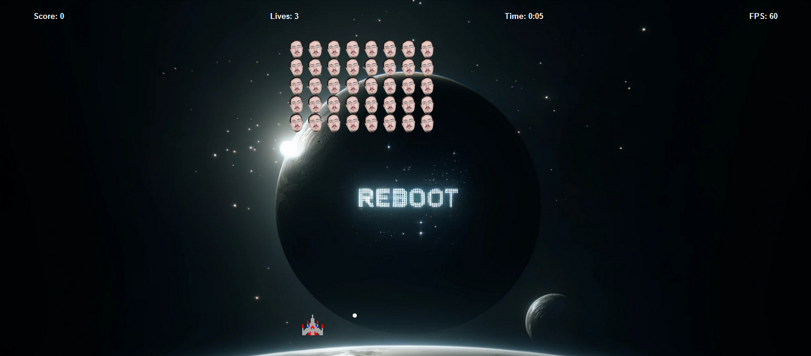
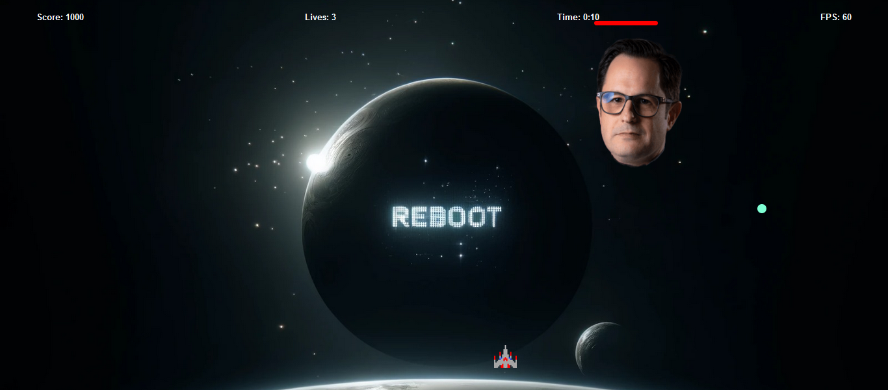

# Space Invaders

A classic Space Invaders game built with JavaScript, HTML, and CSS.





## Table of Contents

- [Introduction](#introduction)
- [Features](#features)
- [Installation](#installation)
- [Usage](#usage)
- [Contributing](#contributing)

## Introduction

This project is a recreation of the classic Space Invaders game. The player controls a spaceship and must shoot down waves of aliens while avoiding their bullets. The game includes a boss fight, sound effects, and a scoring system.

## Features

- Player movement and shooting
- Alien waves with movement and shooting
- Boss fight with health bar
- Sound effects for various actions
- Scoring system
- Pause, resume, and restart functionality

## Installation

1. Clone the repository:
   ```sh
   git clone https://github.com/HASANALI117/make-your-game.git
   ```
2. Navigate to the project directory:
   ```sh
   cd make-your-game
   ```
3. Open `index.html` in your web browser to start the game.

## Usage

- Use the arrow keys to move the player left and right.
- Press the spacebar to shoot bullets.
- Avoid enemy bullets and shoot down all aliens to progress to the boss fight.
- Defeat the boss to win the game.
- Press `Escape` to pause the game and `Enter` to resume or restart.

## Contributing

Contributions are welcome! Please open an issue or submit a pull request for any improvements or bug fixes.
